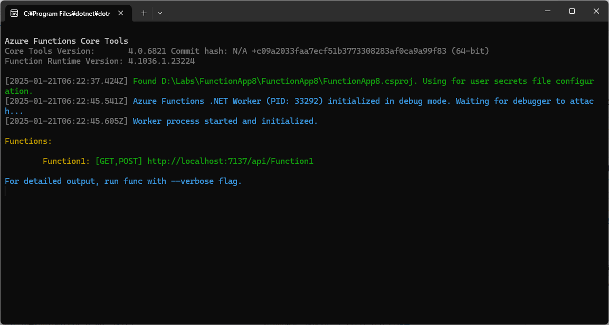

# AzureFunctionsLab

Azure Functions と Durable Functions のラボです。

## 事前準備

Windows 11 に以下のツールをインストールしてください。

- Visual Studio 2022
  - https://visualstudio.microsoft.com/ja/vs/
  - インストール時に有効可するワークロード
    - ASP.NET と Web 開発
    - Azure の開発
- Azure Storage Explorer
  - https://azure.microsoft.com/ja-jp/products/storage/storage-explorer
- 共同管理者権限を持つ Azure サブスクリプション (オプション)
  - Azure Functions と Azure Storage のリソースを作成するために必要です。

動作確認として以下の手順を実行してください。

- Visual Studio 2022 の起動
  - 初回起動時にはサインインを求められるので、ライセンスを持っている Microsoft アカウントでサインインしてください。
- Azure Functions のプロジェクトの新規作成
  - 各種選択肢は規定のものを選択したままにしてください
- デバッグ実行
- エラーが出ずに以下のような画面が出れば確認は完了です

## ラボ

TBD
