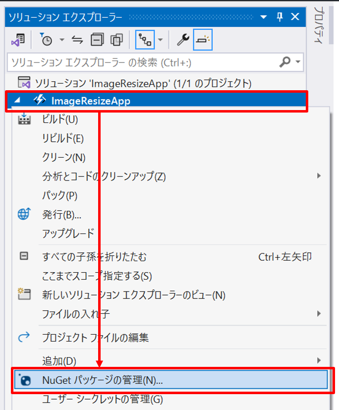

# Azure Functions ラボ

## はじめに

このラボでは Blob ストレージに画像をアップロードするとサムネイル画像を作成する Azure Functions を作成します。
アップロードされた画像とサムネイル画像を取得するための HTTP トリガーの関数も作成します。
オプションとして作成した Azure Functions を実際に Azure にデプロイして動作させます。

## 作成する関数

1. 画像のサムネイル作成関数
   - トリガー：Blob トリガー
2. 画像を取得する関数
   - トリガー：HTTP トリガー
3. サムネイル画像を取得する関数
   - トリガー：HTTP トリガー

## ラボの手順

### 1. Azure Functions プロジェクトの作成

Visual Studio の起動時の画面から「新しいプロジェクトの作成」を選択してください。


プロジェクト テンプレートの「Azure Functions」を選択して言語が C# になっていることを確認した後に「次へ」を選択してください。


プロジェクト名を入力して「次へ」を選択してください。ここではプロジェクト名を `ImageResizeApp` とします。


以下の情報を入力して「作成」を選択してください。

- Functions worker
  - .NET 8.0 Isolated (長期的なサポート)
- Function
  - Blob trigger
- ランタイム ストレージアカウントに Azurite を仕様する (AzureWebJobsStorage)
  - チェックを入れる
- Path
  - images


以上の手順で Azure Functions プロジェクトが作成されます。また、最後の画面で設定したように Blob トリガーの関数も作成されます。

以降の手順では、作成された Blob トリガーの関数に画像のサムネイル作成処理を追加していきます。

### 2. 画像のサムネイル作成処理の追加

作成された Blob トリガーの関数に画像のサムネイル作成処理を追加します。

ソリューションエクスプローラーで `Function1.cs` を `CreateThumbnailFunction.cs` にリネームしてください。リネームの際にクラス名の変更を行うか確認ダイアログが出るのでクラス名の変更もあわせて行ってください。


次に画像をリサイズするための SkiaSharp を NuGet から追加します。

> [!NOTE]
> Windows OS の場合は `System.Drawing` を使うことで画像のリサイズが可能ですが、Linux OS ではサポートされません。詳細については [System.Drawing.Common が Windows でしかサポートされない](https://learn.microsoft.com/ja-jp/dotnet/core/compatibility/core-libraries/6.0/system-drawing-common-windows-only) を参照してください。
> Azure Functions では Linux OS で動作をするように作成した方が Flex 従量課金が利用可能であったり Linux OS の方が低コストで利用可能なため可能であれば Linux OS で動作するように作成することが望ましいです。そのためこのサンプルでは Linux OS でも動作可能な `SkiaSharp` を使って画像のリサイズを行います。

プロジェクトを右クリックして「NuGet パッケージの管理」を選択してください。



参照タブを選択して `SkiaSharp` で検索して以下の 2 つのパッケージをインストールしてください。

- `SkiaSharp`
  - SkiaSharp の本体
- `SkiaSharp.NativeAssets.Linux.NoDependencies`
  - SkiaSharp の Linux 用のネイティブ ライブラリ。Linux で動作するために必要。Windows のみで動かす場合には不要。


パッケージを追加したので画像のリサイズ処理を実装します。
`ImageResizer.cs` というファイルを追加して以下のコードを追加してください。

```csharp:ImageResizer.cs
using SkiaSharp;

namespace ImageResizeApp;
public class ImageResizer
{
    public byte[] ResizeImage(string name, 
        byte[] image, 
        int width)
    {
        var extension = Path.GetExtension(name);
        var imageFormat = extension.ToLowerInvariant() switch
        {
            ".jpg" or ".jpeg" => SKEncodedImageFormat.Jpeg,
            ".png" => SKEncodedImageFormat.Png,
            ".bmp" => SKEncodedImageFormat.Bmp,
            ".gif" => SKEncodedImageFormat.Gif,
            _ => throw new NotSupportedException($"{extension} はサポートされていません。")
        };

        using var bitmap = SKBitmap.Decode(image);
        var height = (int)(width * (float)bitmap.Height / bitmap.Width);
        using var thumbnail = bitmap.Resize(new SKSizeI(width, height), SKSamplingOptions.Default);
        using var data = thumbnail.Encode(imageFormat, 50);
        return data.ToArray();
    }
}
```

このクラスを関数から使用するために DI コンテナに登録します。`Program.cs` を開いて以下のコードを追加してください。

```csharp:Program.cs
// builder.ConfigureFunctionsWebApplication(); の下に追加
builder.Services.AddSingleton<ImageResizer>();
```

これで、画像のリサイズ処理を行うためのクラスを関数で使用する準備が出来ました。`CreateThumbnailFunction.cs` に画像のリサイズ処理を追加します。以下のようにファイルを書き換えてください。

```csharp:CreateThumbnailFunction.cs
using Microsoft.Azure.Functions.Worker;
using Microsoft.Extensions.Logging;

namespace ImageResizeApp;

public partial class CreateThumbnailFunction(
    ImageResizer imageResizer,
    ILogger<CreateThumbnailFunction> logger)
{
    [Function(nameof(CreateThumbnailFunction))]
    [BlobOutput("thumbnails/{name}")]
    public byte[] Run([BlobTrigger("images/{name}")] byte[] image, string name)
    {
        logger.LogInformation("CreateThumbnailFunction invoked: Name = {name}", name);
        return imageResizer.ResizeImage(name, image, 500);
    }
}
```

ここでは `images` フォルダーに追加されたファイルを幅 500px にリサイズして `thumbnails` フォルダーに保存する処理を追加しています。

プロジェクトをビルドしてコンパイルエラーがないことを確認してください。エラーが出た場合はエラーメッセージを確認して修正してください。GitHub Copilot が使用できる場合はエラー一覧ウィンドウから提案を確認して修正することも可能です。


> [!NOTE]
> 2025年1月時点では GitHub Copilot は最新の C# の文法を学習していないため GitHub Copilot が提案するコードは最新の文法を使用していない場合があります。そのため、提案されたコードをそのまま使用する場合は文法を確認して修正してください。

### 3. サムネイル作成処理の確認

作成したサムネイル作成処理を確認するためにローカルで実行してみます。Visual Studio で `F5` キーを押してデバッグ実行してください。