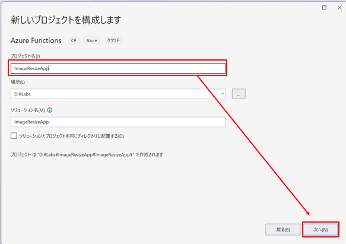

# Azure Functions ラボ

## はじめに

このラボでは Blob ストレージに画像をアップロードするとサムネイル画像を作成する Azure Functions を作成します。
アップロードされた画像とサムネイル画像を取得するための HTTP トリガーの関数も作成します。
オプションとして作成した Azure Functions を実際に Azure にデプロイして動作させます。

## 作成する関数

1. 画像のサムネイル作成関数
   - トリガー：Blob トリガー
2. 画像を取得する関数
   - トリガー：HTTP トリガー
3. サムネイル画像を取得する関数
   - トリガー：HTTP トリガー

## ラボの手順

### 1. Azure Functions プロジェクトの作成

Visual Studio の起動時の画面から「新しいプロジェクトの作成」を選択してください。

プロジェクト テンプレートの「Azure Functions」を選択して言語が C# になっていることを確認した後に「次へ」を選択してください。

プロジェクト名を入力して「次へ」を選択してください。ここではプロジェクト名を `ImageResizeApp` とします。

以下の情報を入力して「作成」を選択してください。

- Functions worker
  - .NET 8.0 Isolated (長期的なサポート)
- Function
  - Blob trigger
- ランタイム ストレージアカウントに Azurite を仕様する (AzureWebJobsStorage)
  - チェックを入れる
- Path
  - images

以上の手順で Azure Functions プロジェクトが作成されます。また、最後の画面で設定したように Blob トリガーの関数も作成されます。

以降の手順では、作成された Blob トリガーの関数に画像のサムネイル作成処理を追加していきます。

### 2. 画像のサムネイル作成処理の追加

作成された Blob トリガーの関数に画像のサムネイル作成処理を追加します。

