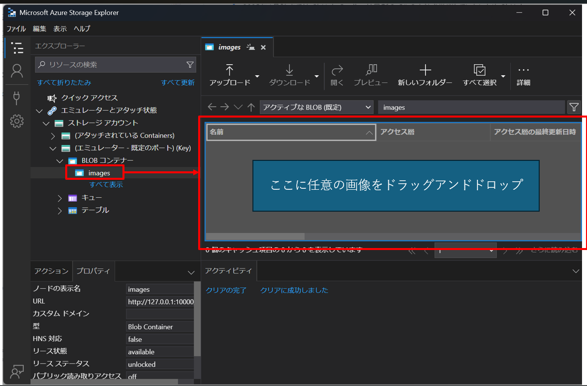
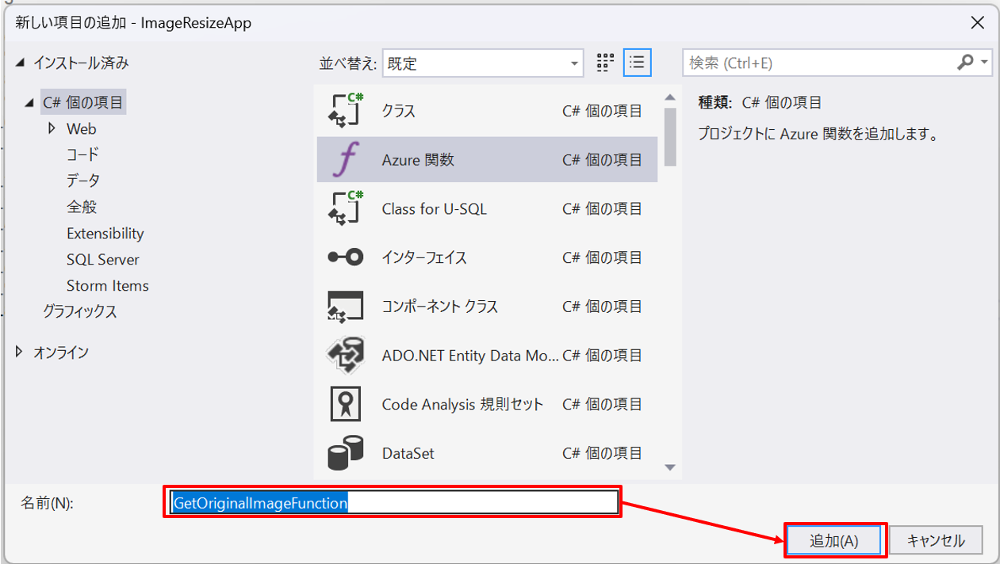

# Azure Functions ラボ

## はじめに

このラボでは Blob ストレージに画像をアップロードするとサムネイル画像を作成する Azure Functions を作成します。
アップロードされた画像とサムネイル画像を取得するための HTTP トリガーの関数も作成します。
オプションとして作成した Azure Functions を実際に Azure にデプロイして動作させます。

## 作成する関数

1. 画像のサムネイル作成関数
   - トリガー：Blob トリガー
2. 画像を取得する関数
   - トリガー：HTTP トリガー
3. サムネイル画像を取得する関数
   - トリガー：HTTP トリガー

## ラボの手順

### 1. Azure Functions プロジェクトの作成

1. Visual Studio の起動時の画面から「新しいプロジェクトの作成」を選択してください。

   

2. プロジェクト テンプレートの「Azure Functions」を選択して言語が C# になっていることを確認した後に「次へ」を選択してください。

   

3. プロジェクト名を入力して「次へ」を選択してください。ここではプロジェクト名を `ImageResizeApp` とします。

   

4. 以下の情報を入力して「作成」を選択してください。

   - Functions worker
     - .NET 8.0 Isolated (長期的なサポート)
   - Function
     - Blob trigger
   - ランタイム ストレージアカウントに Azurite を仕様する (AzureWebJobsStorage)
     - チェックを入れる
   - Path
     - images

   

以上の手順で Azure Functions プロジェクトが作成されます。また、最後の画面で設定したように Blob トリガーの関数も作成されます。

以降の手順では、作成された Blob トリガーの関数に画像のサムネイル作成処理を追加していきます。

### 2. 画像のサムネイル作成処理の追加

1. 作成された Blob トリガーの関数に画像のサムネイル作成処理を追加します。

   ソリューションエクスプローラーで `Function1.cs` を `CreateThumbnailFunction.cs` にリネームしてください。リネームの際にクラス名の変更を行うか確認ダイアログが出るのでクラス名の変更もあわせて行ってください。

   

2. 次に画像をリサイズするための SkiaSharp を NuGet から追加します。

   > [!NOTE]
   > Windows OS の場合は `System.Drawing` を使うことで画像のリサイズが可能ですが、Linux OS ではサポートされません。詳細については [System.Drawing.Common が Windows でしかサポートされない](https://learn.microsoft.com/ja-jp/dotnet/core/compatibility/core-libraries/6.0/system-drawing-common-windows-only) を参照してください。
   > Azure Functions では Linux OS で動作をするように作成した方が Flex 従量課金が利用可能であったり Linux OS の方が低コストで利用可能なため可能であれば Linux OS で動作するように作成することが望ましいです。そのためこのサンプルでは Linux OS でも動作可能な `SkiaSharp` を使って画像のリサイズを行います。

   プロジェクトを右クリックして「NuGet パッケージの管理」を選択してください。

   

3. 参照タブを選択して `SkiaSharp` で検索して以下の 2 つのパッケージをインストールしてください。

   - `SkiaSharp`
     - SkiaSharp の本体
   - `SkiaSharp.NativeAssets.Linux.NoDependencies`
     - SkiaSharp の Linux 用のネイティブ ライブラリ。Linux で動作するために必要。Windows のみで動かす場合には不要。

   

4. パッケージを追加したので画像のリサイズ処理を実装します。
   `ImageResizer.cs` というファイルを追加して以下のコードを追加してください。

   ```csharp:ImageResizer.cs
   using SkiaSharp;

   namespace ImageResizeApp;
   public class ImageResizer
   {
       public byte[] ResizeImage(string name, 
           byte[] image, 
           int width)
       {
           var extension = Path.GetExtension(name);
           var imageFormat = extension.ToLowerInvariant() switch
           {
               ".jpg" or ".jpeg" => SKEncodedImageFormat.Jpeg,
               ".png" => SKEncodedImageFormat.Png,
               ".bmp" => SKEncodedImageFormat.Bmp,
               ".gif" => SKEncodedImageFormat.Gif,
               _ => throw new NotSupportedException($"{extension} はサポートされていません。")
           };

           using var bitmap = SKBitmap.Decode(image);
           var height = (int)(width * (float)bitmap.Height / bitmap.Width);
           using var thumbnail = bitmap.Resize(new SKSizeI(width, height), SKSamplingOptions.Default);
           using var data = thumbnail.Encode(imageFormat, 50);
           return data.ToArray();
       }
   }
   ```

5. このクラスを関数から使用するために DI コンテナに登録します。`Program.cs` を開いて以下のコードを追加してください。

   ```csharp:Program.cs
   // ...existing code...
   // builder.ConfigureFunctionsWebApplication(); の下に追加
   builder.Services.AddSingleton<ImageResizer>();
   // ...existing code...
   ```

これで、画像のリサイズ処理を行うためのクラスを関数で使用する準備が出来ました。`CreateThumbnailFunction.cs` に画像のリサイズ処理を追加します。以下のようにファイルを書き換えてください。

```csharp:CreateThumbnailFunction.cs
// ...existing code...
using Microsoft.Azure.Functions.Worker;
using Microsoft.Extensions.Logging;
// ...existing code...

public class CreateThumbnailFunction(
    ImageResizer imageResizer,
    ILogger<CreateThumbnailFunction> logger)
{
    [Function(nameof(CreateThumbnailFunction))]
    [BlobOutput("thumbnails/{name}")]
    public byte[] Run([BlobTrigger("images/{name}")] byte[] image, string name)
    {
        logger.LogInformation("CreateThumbnailFunction invoked: Name = {name}", name);
        return imageResizer.ResizeImage(name, image, 500);
    }
}
// ...existing code...
```

ここでは `images` フォルダーに追加されたファイルを幅 500px にリサイズして `thumbnails` フォルダーに保存する処理を追加しています。

プロジェクトをビルドしてコンパイルエラーがないことを確認してください。エラーが出た場合はエラーメッセージを確認して修正してください。GitHub Copilot が使用できる場合はエラー一覧ウィンドウから提案を確認して修正することも可能です。


> [!NOTE]
> 2025年1月時点では GitHub Copilot は最新の C# の文法を学習していないため GitHub Copilot が提案するコードは最新の文法を使用していない場合があります。そのため、提案されたコードをそのまま使用する場合は文法を確認して修正してください。

### 3. サムネイル作成処理の確認

1. 作成したサムネイル作成処理を確認するためにローカルで実行してみます。Visual Studio で `F5` キーを押してデバッグ実行してください。
   デバッグ実行を行うと以下のような画面が表示されます。作成した `CreateThumbnailFunction` が表示されていることを確認してください。

   

2. Microsoft Azure Storage Explorer を起動して「ストレージアカウント」→「（エミュレーター - 規定のポート）(Key)」→「BLOB コンテナー」の下に `images` コンテナーを作成して、作成したコンテナーに任意の画像ファイルをアップロードしてください。

   

3. アップロードした画像ファイルが `images` コンテナーにアップロードされると `thumbnails` コンテナーにサムネイル画像が作成されます。処理が動作しているか確認するために `thumbnails` コンテナーにサムネイル画像が作成されているか確認してください。初回のタイミングでは `thumbnails` コンテナーを表示するために「（エミュレーター - 規定のポート）(Key)」の右クリックメニューから「最新の情報に更新」を選択してください。

   

4. デバッグ実行時に表示されたウィンドウには `CreateThumbnailFunction` の実行ログが表示されています。

   

> [!NOTE]
> オプション：Visual Studio でブレークポイントを置いてデバッグ実行することで処理の中身を確認することができます。ブレークポイントを設定するには関数の左側の行番号の部分をクリックすると赤い丸が表示されます。ブレークポイントを解除するには再度クリックして赤い丸が消えるようにしてください。

動作確認ができたらデバッグ実行を停止してください。

### 4. 画像を取得する関数の作成

1. 画像を取得するための HTTP トリガーの関数を作成します。

   プロジェクトの右クリックメニューから「追加」→「新しい Azure 関数…」を選択します。

   

2. 名前に `GetOriginalImageFunction` と入力して「追加」を選択してください。

   

3. Http Trigger を選択して「追加」を選択してください。

   

4. `GetOriginalImageFunction` が作成されます。

**同様の手順で `GetThumbnailImageFunction` も作成してください。**

5. 作成した関数に画像を取得する処理を追加します。`GetOriginalImageFunction.cs` のコードを以下のように書き換えてください。

   ```csharp:GetOriginalImageFunction.cs
   // ...existing code...
   using Azure.Storage.Blobs;
   using Microsoft.AspNetCore.Http;
   using Microsoft.AspNetCore.Mvc;
   using Microsoft.Azure.Functions.Worker;
   // ...existing code...

   public class GetOriginalImageFunction
   {
       [Function("GetOriginalImageFunction")]
       public async Task<IActionResult> Run(
           [HttpTrigger(AuthorizationLevel.Function, "get", Route = "images/{name}")] HttpRequest req,
           [BlobInput("images/{name}")]
           BlobClient blobClient)
       {
           if (!await blobClient.ExistsAsync()) return new NotFoundResult();

           var content = await blobClient.DownloadContentAsync();
           var extension = Path.GetExtension(blobClient.Name).TrimStart('.');
           return new FileContentResult(content.Value.Content.ToArray(), $"image/{extension}");
       }
   }
   // ...existing code...
   ```

6. `GetThumbnailImageFunction.cs` のコードを以下のように書き換えてください。

   ```csharp:GetThumbnailImageFunction.cs
   // ...existing code...
   using Azure.Storage.Blobs;
   using Microsoft.AspNetCore.Http;
   using Microsoft.AspNetCore.Mvc;
   using Microsoft.Azure.Functions.Worker;
   // ...existing code...

   public class GetThumbnailImageFunction
   {
       [Function("GetThumbnailImageFunction")]
       public async Task<IActionResult> Run(
           [HttpTrigger(AuthorizationLevel.Function, "get", Route = "thumbnails/{name}")] HttpRequest req,
           [BlobInput("thumbnails/{name}")]
           BlobClient blobClient)
       {
           if (!await blobClient.ExistsAsync()) return new NotFoundResult();

           var content = await blobClient.DownloadContentAsync();
           var extension = Path.GetExtension(blobClient.Name).TrimStart('.');
           return new FileContentResult(content.Value.Content.ToArray(), $"image/{extension}");
       }
   }
   // ...existing code...
   ```

### 5. ローカルで動作確認

1. 作成した関数をローカルで動作確認します。Visual Studio で `F5` キーを押してデバッグ実行してください。
   デバッグ実行をすると以下のような画面が表示されます。作成した `GetOriginalImageFunction` と `GetThumbnailImageFunction` が表示されていることを確認してください。

   

2. 表示されている URL の `{name}` の部分をアップロードしたファイル名にしてブラウザでアクセスすると画像が表示されます。存在しない画像の名前を指定すると `404` エラーが表示されます。

`GetOriginalImageFunction` と `GetThumnbailImageFunction` の動作確認ができたらデバッグ実行を停止してください。

ハンズオンの手順は以上です。以降の手順はオプションとなります。

### 6. Azure へのデプロイ (オプション)

> [!WARNING]
> Azure リソースを使用すると料金が発生します。このラボで使用した Azure リソースについては、Azure Portal で確認してください。ハンズオン終了後に必ず Azure ポータルでリソースを削除してください。

作成した Azure Functions を Azure にデプロイして動作させます。以下のドキュメントの「Azure に発行する」の手順に従ってデプロイしてください。

> [!NOTE]
> このドキュメントの手順では OS は Windows になっていますが、今回のコードは Linux でも動作します。
> 好きな方の OS を選択してデプロイしてください。

https://learn.microsoft.com/ja-jp/azure/azure-functions/functions-develop-vs?pivots=isolated#publish-to-azure

デプロイが完了したら Azure Portal で Azure Functions の画面を開いてデプロイした関数が表示されていることを確認してください。


### 7. Azure での動作確認 (オプション)

1. デプロイした Azure Functions が正常に動作しているか確認します。Azure Portal で Azure Functions と同時にデプロイされたストレージアカウントを選択してください。

   

2. ストレージブラウザーを選択すると Microsoft Azure Storage Explorer のような画面が表示されます。「＋コンテナーの追加」を選択して `images` コンテナーを追加してください。

   

   > [!NOTE]
   > 作成画面のスクリーンショットは省略しています。

3. 以下のようなエラーが表示された場合は「アクセスキーに切り替える」を選択してください。

   

   > [!NOTE]
   > Azure のリソースへのアクセスには大きくわけて2つの方法があります。
   > アクセスキーを使用する方法と Microsoft Entra ID ベースの認証を使用する方法です。運用環境では Microsoft Entra ID ベースの認証を使用することを推奨しますが、ここではアクセスキーを使用する方法で説明しています。

4. `images` コンテナーに画像ファイルをアップロードしてください。アップロードを行うと関数が実行されて `thumbnails` コンテナーにサムネイル画像が作成されます。

   

5. 作成された `thumbnails` コンテナーにサムネイル画像が作成されていることを確認してください。

   

6. 作成した `GetOriginalImageFunction` と `GetThumbnailImageFunction` を使用して画像を取得することができます。`GetOriginalImageFunction` と `GetThumbnailImageFunction` 関数は関数レベルの認証がかかっているため Azure Functions のキーが必要になります。
   キーは Azure Functions のアプリキーから取得することも可能ですが、キー付きの URL を `GetOriginalImageFunction` か `GetThumbnailImageFunction` を選択した画面で「関数の URL の取得」から「default (ファンクションキー)」で URL が取得できます。

   

7. この URL の `{name}` の部分を Blob ストレージにアップロードしたファイル名にして Azure Functions を実行すると画像が表示されます。

確認が出来たらハンズオンは終了です。Azure Portal でリソースを削除してください。

> [!WARNING]
> このハンズオン ラボでは、Azure Functions の HTTP トリガーの関数からバイナリデータ（画像データ）を返しています。これは、小さなファイルには問題ありませんが、大きなファイルを返す場合は、Azure Functions の制限 (実行時間の制限や大きなファイルをメモリ上に展開することによるメモリ不足など) によりエラーが発生する可能性があります。大きなファイルを返す場合は、Azure Functions から直接ファイルを返すのではなく、Azure Blob Storage などのストレージ サービスに保存して Azure Functions からはストレージアカウントの対象のファイルの URL を返すようにすることをお勧めします。
>
> Azure Functions の制限については [Azure Functions のホスティング オプション](https://learn.microsoft.com/ja-jp/azure/azure-functions/functions-scale) の「サービスの制限」のセクションを参照してください。

