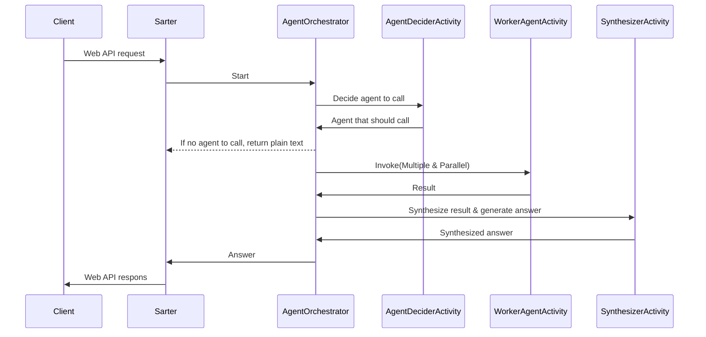
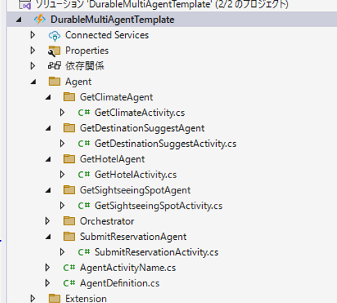
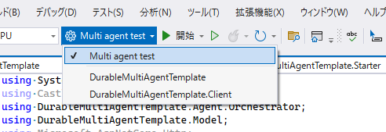
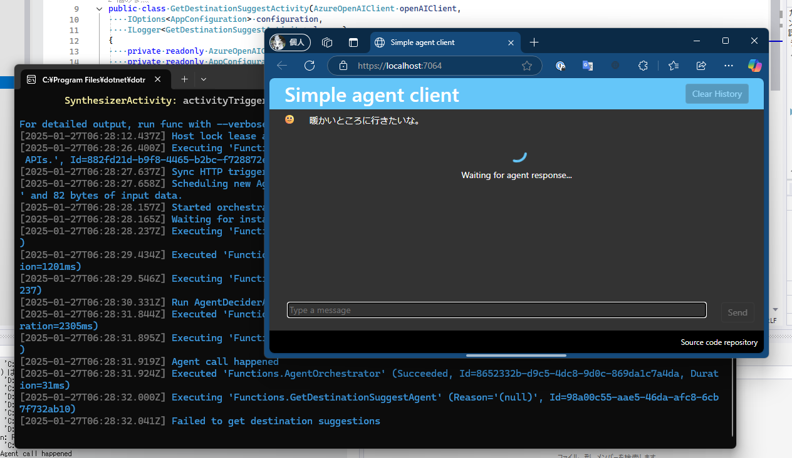
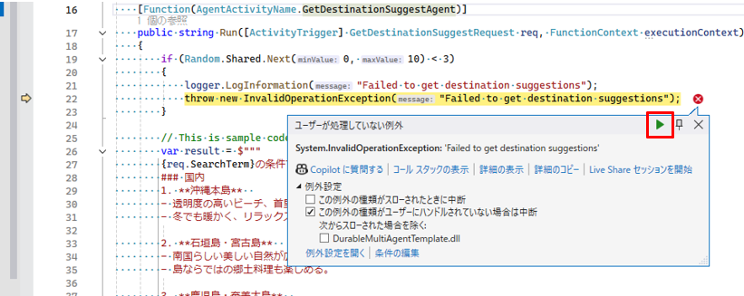

# Durable Functions ラボ

## はじめに

このラボでは Durable Functions を使用して AI Agent のオーケストレーションを行う処理を実装します。

このラボで実装する処理の流れは以下のようになっています。



`Client` からのリクエストを受け取り、`Agent` のオーケストレーションを行い、結果を返す処理を実装します。`AgentOrchestrator` は `AgentDeciderActivity` を呼び出し、どの `Agent` を呼び出すかを決定します。`AgentDeciderActivity` は `Client` からの要求に応じて最適な `Agent` を複数個選択し、`AgentOrchestrator` に返します。`AgentOrchestrator` は選択された複数の `Agent` を並列で呼び出します。このシーケンス図ではこれらの選択されたアクティビティを `WorkerAgentActivity` と表しています。`AgentOrchestrator` は `WorkerAgentActivity` が返した結果を `SynthesizerActivity` に渡し、結果を合成し、最終的な結果を生成します。最終的な結果は `Client` に返されます。

## エージェントの概要

このラボで実装するエージェントは旅行代理店のエージェントになります。行先のサジェストや気候、観光名所、ホテルの情報を提供します。また、宿泊先の予約を行うエージェントも提供します。このエージェントを使用した会話の例を以下に示します。

```plaintext
User: 暖かいところに行きたいなぁ

Agent: 暖かい旅行先をお探しなら、以下の場所を検討してみてください。国内外でおすすめの目的地があります。

国内おすすめ
沖縄本島

美しいビーチや観光名所が豊富で、冬でも暖かいです。
石垣島・宮古島

南国の自然が広がり、ダイビングや郷土料理が楽しめます。
鹿児島・奄美大島

亜熱帯の雰囲気と特有の自然環境を満喫できます。
海外おすすめ
ハワイ（オアフ島やマウイ島）

快適な気温と多様なアクティビティ、日本語対応も充実。
タイ（プーケットやクラビ）

手頃な価格で温かい気候とタイ料理を楽しめます。
バリ島（インドネシア）

ヒンズー文化と自然が織りなす雰囲気が魅力。
オーストラリア（ケアンズやゴールドコースト）

グレートバリアリーフでの海洋アクティビティが人気。
グアムやサイパン

日本から近く、短期間でも楽しめるリゾート地です。
予算や旅行期間に応じて最適な場所を選んでみてください！

使用されたエージェント: GetDestinationSuggestAgent

User: バリ島いいですね。お勧めの観光名所やお勧めの季節はありますか？

Agent: バリ島は自然や文化が多様で、訪れるべき観光名所がたくさんあります。また、訪れる季節も考慮するとより楽しめます。以下におすすめの観光スポットと季節をまとめました。

おすすめの観光名所
タナロット寺院（Pura Tanah Lot）

海の上に建つ寺院で、特に夕日と共に見る景色が絶景です。
ウルワツ寺院（Pura Luhur Uluwatu）

崖の上に位置し、インド洋を見渡す絶景スポット。夕方にはケチャダンスの公演があります。
ウブドのライステラス（Tegalalang Rice Terrace）

階段状に広がる田んぼの風景が特徴的で、写真撮影やトレッキングに最適です。
クタビーチ

サーフィン初心者に人気のスポットで、多くのレストランやショップがある賑やかなビーチです。
ヌサ・ドゥア

高級リゾートエリアで、静かなビーチと透明度の高い海が楽しめます。
おすすめの季節
**乾季（5月～10月）**が観光のベストシーズンです。

晴れの日が多く、湿度が比較的低く、海や観光に最適です。
ビーチでのリラックスやダイビング、サーフィン、ウブド周辺でのトレッキングや文化体験が楽しめます。
**雨季（11月～4月）**でも楽しめる工夫がされています。

短時間のスコールがありますが、その後すぐに晴れることも多いです。
室内スパやリゾート内でのリラクゼーション、寺院巡りや地元の文化体験が楽しめます。
乾季の時期は特に観光地も込み合うため、早めの計画が良いでしょう。バリ島の豊かな自然と文化をぜひ楽しんでください！

使用されたエージェント: GetSightseeingSpotAgent, GetClimateAgent

User: いいですね。お勧めのホテルはありますか？

バリ島での滞在におすすめのホテルを4つご紹介します。それぞれ異なる魅力がありますので、旅行の目的に合わせて選んでみてください。

1. リラ・オアシスホテル（Rila Oasis Hotel）
所在地: 海沿いのリゾート地
テーマ: 癒しとウェルネス
特徴:
海を望むインフィニティプール
スパ・ヨガ・瞑想などのウェルネスプログラム
地元食材を使ったヘルシーレストラン
落ち着いた内装でリラクゼーションを重視
2. クラウン・スカイタワー（Crown Skytower）
所在地: 都市部の中心地
テーマ: モダンでラグジュアリーな都市体験
特徴:
高層階からの夜景が楽しめるラグジュアリールーム
最先端の設備を備えたビジネスセンター
ミシュラン星付きレストラン併設
スタイリッシュなデザインとスマートホテル機能
3. フォレスト・ヒドゥンロッジ（Forest Hidden Lodge）
所在地: 森に囲まれた山間部
テーマ: 自然と共に過ごす冒険と安らぎ
特徴:
木造のコテージ風宿泊施設
トレッキングや星空観察のアクティビティ
暖炉付きラウンジと温泉
地元の伝統料理を楽しめるダイニング
4. アルテ・シンフォニア（Arte Sinfonia）
所在地: 歴史的な街並みの一角
テーマ: アートと文化の融合
特徴:
地元アーティストの作品を展示したギャラリー併設
クラシック音楽のライブ演奏が行われるラウンジ
アンティーク家具を取り入れたクラシカルな内装
歴史的建築物をリノベーションした趣のある空間
どのホテルも素敵な滞在体験を提供してくれますので、お好みに合わせて選んでみてください。

使用されたエージェント: GetHotelAgent

User: アルテシンフォニアに泊まりたいです

Agent: 「アルテ・シンフォニア」にご興味をお持ちいただき、ありがとうございます。ご予約のお手伝いをいたしますので、以下の情報を教えてください。

チェックイン日（YYYY/MM/DD形式でお願いします）
チェックアウト日（YYYY/MM/DD形式でお願いします）
宿泊人数
使用されたエージェント:

User: チェックインが2025/05/01で3泊で二人でお願いします。

Agent: 「アルテ・シンフォニア」でのご予約情報は以下の通りです：

チェックイン日: 2025年5月1日
チェックアウト日: 2025年5月4日
宿泊人数: 2名
既にこの条件で予約が完了しています。予約番号は ce083612-baea-4156-b803-e1ad4783e780 です。ご不明な点や追加のご要望がありましたら、お知らせください。楽しい滞在を！

使用されたエージェント: SubmitReservationAgent
```

## ひな形のソースコードの準備

このリポジトリにある `lab02/lab02-start` フォルダーを任意の場所にコピーしてください。

コピーが完了 Visual Studio 2022 で `lab02-start` フォルダーにある `DurableMultiAgentTemplate.sln` を開いてください。

## ソースコードの確認

このコードは 2 つのプロジェクトで構成されています。

1. `DurableMutliAgentTemplate`
   - Durable Functions を使用して AI Agent のオーケストレーションを行う処理を実装します。このラボではこのプロジェクトのみコードを変更します。
2. `DurableMutliAgentTemplate.Client`
   - `DurableMultiAgentTemplate` で定義された Web API を呼び出すための画面を提供します。Blazor Web App で実装されています。

### `DurableMutliAgentTemplate` プロジェクト

このプロジェクトの `Agents` フォルダーには 5 つの AI Agent が実装されています。



それぞれの Agent は以下の機能を提供します。

- `GetDestinationSuggestAgent`
  - "希望の行き先に求める条件を自然言語で与えると、おすすめの旅行先を提案します。
- `GetClimateAgent`
  - 指定された場所の気候を取得します。
- `GetSightseeingSpotAgent`
  - 指定された場所の観光名所を取得します。
- `GetHotelAgent`
  - 指定された場所のホテルを取得します。
- `SubmitReservationAgent`
  - 宿泊先の予約を行います。

このサンプルでは、これらの Agent の多くは 30% の確率でエラーを返すようになっています。さらに応答は、ほぼ固定の文字列を返します。実際のシステムでは Azure OpenAI Service などで提供される AI サービスを呼び出すことになります。

実際に `GetClimateActivity` を見てみましょう。`Run` メソッドの最初で 30% の確率で例外をスローするようになっています。
その後、ほぼ固定の文字列を返しています。

```csharp:SubmitReservationActivity.cs
using Azure.AI.OpenAI;
using DurableMultiAgentTemplate.Model;
using Microsoft.Azure.Functions.Worker;
using Microsoft.Extensions.Logging;
using Microsoft.Extensions.Options;

namespace DurableMultiAgentTemplate.Agent.GetClimateAgent;

public class GetClimateActivity(AzureOpenAIClient openAIClient, 
    IOptions<AppConfiguration> configuration,
    ILogger<GetClimateActivity> logger)
{
    private readonly AzureOpenAIClient _openAIClient = openAIClient;
    private readonly AppConfiguration _configuration = configuration.Value;

    [Function(AgentActivityName.GetClimateAgent)]
    public string Run([ActivityTrigger] GetClimateRequest req, FunctionContext executionContext)
    {
        if(Random.Shared.Next(0, 10) < 3)
        {
            logger.LogInformation("Failed to get climate information");
            throw new InvalidOperationException("Failed to get climate information");
        }

        // This is sample code. Replace this with your own logic.
        var result = $"""
        {req.Location}の気候は年間を通じて暖かく、**熱帯モンスーン気候**に分類されます。大きく分けて**乾季**と**雨季**があり、それぞれ異なる特徴があります。
        ---

        ### 平均気温
        - **年間を通じて：** 26～30℃程度
        - **日中：** 30℃前後まで上がることが多い。
        - **夜間：** 23～25℃程度で過ごしやすい。

        // 中略...

        ---

        {req.Location}は雨季でも旅行を楽しめるよう工夫されているため、いつ訪れても魅力的です。乾季の5月～10月が観光のベストシーズンとされていますが、雨季なら緑豊かな景観と比較的空いている観光地を楽しむことができます。
        """;

        return result;
    }
}
```

他の 4 つの Agent も、ほぼ同様な実装になっています。

#### オーケストレーターから呼び出すアクティビティ

オーケストレーターから呼び出す 2 つのアクティビティが定義されています。`DurableMultiAgentTemplate` プロジェクトの `Agents/Orchestrator` フォルダーに以下の 2 つのアクティビティが定義されています。

1. `AgentDeciderActivity`
   - ユーザーのリクエストに応じて、どの Agent を呼び出すかを決定します。Agent にリクエストするために十分な情報がない場合は、ユーザーに質問を行います。
2. `SynthesizerActivity`
   - Agent からの応答を合成し、最終的な応答を生成します。

この 2 つのアクティビティと 5 つの Agent を使用して AI エージェントのオーケストレーションの実装を行います。

## 接続先の構成

このラボでは `AgentDeciderActivity` と `SynthesizerActivity` で Azure OpenAI Service を使用します。接続先情報は `local.settings.json` に設定します。Azure Functions では `local.settings.json` に設定した情報を環境変数として読み込むことができます。

```json:local.settings.json
{
  "IsEncrypted": false,
  "Values": {
    "AzureWebJobsStorage": "UseDevelopmentStorage=true",
    "FUNCTIONS_WORKER_RUNTIME": "dotnet-isolated",
    "AppConfig:OpenAIEndpoint": "https://{resource name}.openai.azure.com/",
    "AppConfig:OpenAIDeploy": "{model deploy name}",
    "AppConfig:OpenAIAPIKey": "{API Key}" 
  }
}
```

このファイルの `AppConfig:OpenAIEndpoint` に Azure OpenAI Service のエンドポイント、`AppConfig:OpenAIDeploy` にデプロイ名、`AppConfig:OpenAIAPIKey` に API キーを設定します。

> [!NOTE]
> ここで設定した値は `Program.cs` で読み込み `AzureOpenAIClient` に渡されます。該当箇所のコードは以下のリンクから確認できます。
> https://github.com/runceel/AzureFunctionsLab/blob/main/lab02/lab02-start/DurableMultiAgentTemplate/Program.cs#L24-L47

## オーケストレーターの実装

`DurableMultiAgentTemplate` プロジェクトの `Agents/Orchestrator` フォルダーに `AgentOrchestrator` クラスを作成して以下のように実装します。

```csharp:AgentOrchestrator.cs
using DurableMultiAgentTemplate.Model;
using Microsoft.Azure.Functions.Worker;
using Microsoft.DurableTask;
using Microsoft.Extensions.Logging;

namespace DurableMultiAgentTemplate.Agent.Orchestrator;

public class AgentOrchestrator()
{
    [Function(nameof(AgentOrchestrator))]
    public async Task<AgentResponseDto> RunOrchestrator(
        [OrchestrationTrigger] TaskOrchestrationContext context)
    {
        // オーケストレーターで正しくログが出力されるようにするため ReplaySafeLogger を作成
        ILogger logger = context.CreateReplaySafeLogger("AgentOrchestrator");
        var reqData = context.GetInput<AgentRequestDto>();

        ArgumentNullException.ThrowIfNull(reqData);

        // AgentDecider呼び出し（呼び出すAgentの決定）
        var agentDeciderResult = await context.CallActivityAsync<AgentDeciderResult>(AgentActivityName.AgentDeciderActivity, reqData);

        // AgentDeciderでエージェントを呼び出さない場合には、そのまま返す
        if (!agentDeciderResult.IsAgentCall)
        {
            logger.LogInformation("No agent call happened");
            return new AgentResponseDto { Content = agentDeciderResult.Content };
        }

        // AgentDeciderが選択したエージェントを並列で呼び出す
        logger.LogInformation("Agent call happened");
        var parallelAgentCall = new List<Task<string>>();
        foreach (var agentCall in agentDeciderResult.AgentCalls)
        {
            var args = agentCall.Arguments;
            parallelAgentCall.Add(context.CallActivityAsync<string>(agentCall.AgentName, args));
        }

        await Task.WhenAll(parallelAgentCall);

        // Synthesizer呼び出し（回答集約）
        SynthesizerRequest synthesizerRequest = new()
        {
            AgentCallResult = parallelAgentCall.Select(x => x.Result).ToList(),
            AgentReques = reqData,
            CalledAgentNames = agentDeciderResult.AgentCalls.Select(x => x.AgentName).ToList()
        };
        return await context.CallActivityAsync<AgentResponseDto>(AgentActivityName.SynthesizerActivity, synthesizerRequest);
    }
}
```

この `README` の先頭で示したシーケンス図の処理を実装しています。

## スターターの実装

次に `AgentOrchestrator` を起動するスターター関数を実装します。これは画面から呼び出される HTTP トリガー関数です。`DurableMultiAgentTemplate` プロジェクトに `Starter.cs` があります。以下のような空の `SyncStarter` 関数の実装があるので、そこを見つけてください。

```csharp:Starter.cs
[Function("SyncStarter")]
public async Task<HttpResponseData> SyncStarter(
    [HttpTrigger(AuthorizationLevel.Function, "post", Route = "invoke/sync")] HttpRequestData req,
    [DurableClient] DurableTaskClient client)
{
    // ここにオーケストレーターを呼び出す処理を記述します
    return req.CreateResponse(System.Net.HttpStatusCode.OK);
}
```

このコードを以下のように変更してください。

```csharp:Starter.cs
[Function("SyncStarter")]
public async Task<HttpResponseData> SyncStarter(
    [HttpTrigger(AuthorizationLevel.Function, "post", Route = "invoke/sync")] HttpRequestData req,
    [DurableClient] DurableTaskClient client)
{
    logger.LogInformation("Sync HTTP trigger function processed a request.");
    // リクエスト データを取得
    var reqData = await GetRequestData(req);

    if (reqData == null)
    {
        // リクエスト データがない場合は、BadRequest を返す
        var badRequestResponse = req.CreateResponse(System.Net.HttpStatusCode.BadRequest);
        await badRequestResponse.WriteStringAsync("Please pass a prompt in the request body");
        return badRequestResponse;
    }

    // AgentOrchestrator オーケストレーションを開始
    var instanceId = await client.ScheduleNewOrchestrationInstanceAsync(nameof(AgentOrchestrator), reqData);

    logger.LogInformation($"Started orchestration with ID = '{instanceId}'.");

    // インスタンスの完了を待機し、結果を取得
    var metadata = await client.WaitForInstanceCompletionAsync(instanceId, getInputsAndOutputs: true);

    // レスポンスを作成して返却
    var res = HttpResponseData.CreateResponse(req);
    await res.WriteStringAsync(metadata.SerializedOutput ?? "");
    return res;
}
```

このコードは HTTP トリガー関数として動作し、リクエストを受け取ると `AgentOrchestrator` オーケストレーションを開始します。オーケストレーションの完了を待機し、結果を返します。

## 動作確認

Visual Studio のツールバーにある開始ボタンの左にあるプロファイル ドロップダウンから `Multi agent test` を選択します。



デバッグ実行をすると `DurableMultiAgentTemplate` プロジェクトと `DurableMultiAgentTemplate.Client` プロジェクトが起動します。起動に失敗した場合は、一度デバッグ実行を停止し、再度デバッグ実行を行ってください。

以下のように Azure Functions のローカル実行環境とブラウザーが立ち上がりチャットが行えるようになります。



> [!NOTE]
> 各エージェントは 30% の確率でエラーを返すようになっています。そのため、エラーが発生することがあります。その場合は以下の赤枠の緑色の再生ボタンを選択して処理を続行してください。このエラーへの対応は、この後の手順で行います。
> 

## リトライ処理の追加

Durable Functions ではオーケストレーターから Activity が呼び出された際に、Activity が失敗した時にリトライを行うことができます。リトライの設定は `CallActivityAsync` の引数に `TaskOptions` を指定することで行います。`TaskOptions` には `TaskRetryOptions` を指定することが出来ます。`TaskDelayOptions` に `RetryPolicy` を指定することでリトライの設定を行うことができます。

`AgentOrchestrator` にリトライ処理を追加します。今回はリトライの構成は全ての Activity で同じ設定を使うため `AgentOrcehstrator` クラスの `static` プロパティとして `TaskOptions` を定義します。以下のように `AgentOrchestrator` クラスに `TaskOptions` を追加します。

```csharp:AgentOrchestrator.cs
public class AgentOrchestrator()
{
    // リトライを構成した TaskOptions を定義
    private static TaskOptions DefaultTaskOptions { get; } = new(
    new TaskRetryOptions(new RetryPolicy(
        3,
        TimeSpan.FromSeconds(1),
        1,
        TimeSpan.FromSeconds(10))));

    [Function(nameof(AgentOrchestrator))]
    public async Task<AgentResponseDto> RunOrchestrator(
        [OrchestrationTrigger] TaskOrchestrationContext context)
    {
        // 省略
    }
}
```

次に `AgentOrchestrator` で Activity を呼び出す際に `TaskOptions` を指定します。以下のように `AgentOrchestrator` クラスの `RunOrchestrator` メソッド内で Activity を呼び出す `CallActivityAsync` メソッドの第三引数に `TaskOptions` を指定するように変更します。(全部で 3 箇所あります。)

ここまでの変更を適用すると `AgentOrchestrator` クラスは以下のようになります。

```csharp:AgentOrchestrator.cs
using DurableMultiAgentTemplate.Model;
using Microsoft.Azure.Functions.Worker;
using Microsoft.DurableTask;
using Microsoft.Extensions.Logging;

namespace DurableMultiAgentTemplate.Agent.Orchestrator;

public class AgentOrchestrator()
{
    // リトライを構成した TaskOptions を定義
    private static TaskOptions DefaultTaskOptions { get; } = new(
    new TaskRetryOptions(new RetryPolicy(
        3,
        TimeSpan.FromSeconds(1),
        1,
        TimeSpan.FromSeconds(10))));

    [Function(nameof(AgentOrchestrator))]
    public async Task<AgentResponseDto> RunOrchestrator(
        [OrchestrationTrigger] TaskOrchestrationContext context)
    {
        // オーケストレーターで正しくログが出力されるようにするため ReplaySafeLogger を作成
        ILogger logger = context.CreateReplaySafeLogger("AgentOrchestrator");
        var reqData = context.GetInput<AgentRequestDto>();

        ArgumentNullException.ThrowIfNull(reqData);

        // AgentDecider呼び出し（呼び出すAgentの決定）
        var agentDeciderResult = await context.CallActivityAsync<AgentDeciderResult>(AgentActivityName.AgentDeciderActivity, reqData, DefaultTaskOptions);

        // AgentDeciderでエージェントを呼び出さない場合には、そのまま返す
        if (!agentDeciderResult.IsAgentCall)
        {
            logger.LogInformation("No agent call happened");
            return new AgentResponseDto { Content = agentDeciderResult.Content };
        }

        // AgentDeciderが選択したエージェントを並列で呼び出す
        logger.LogInformation("Agent call happened");
        var parallelAgentCall = new List<Task<string>>();
        foreach (var agentCall in agentDeciderResult.AgentCalls)
        {
            var args = agentCall.Arguments;
            parallelAgentCall.Add(context.CallActivityAsync<string>(agentCall.AgentName, args, DefaultTaskOptions));
        }

        await Task.WhenAll(parallelAgentCall);

        // Synthesizer呼び出し（回答集約）
        SynthesizerRequest synthesizerRequest = new()
        {
            AgentCallResult = parallelAgentCall.Select(x => x.Result).ToList(),
            AgentReques = reqData,
            CalledAgentNames = agentDeciderResult.AgentCalls.Select(x => x.AgentName).ToList()
        };
        return await context.CallActivityAsync<AgentResponseDto>(AgentActivityName.SynthesizerActivity, synthesizerRequest, DefaultTaskOptions);
    }
}
```

これでリトライ処理が追加されました。

## 動作確認

リトライ処理が追加されたので、再度デバッグ実行を行い、動作確認を行ってください。今度は、エージェントの処理で例外が起きて処理が止まった場合でも、処理の続行を行うことでリトライが行われチャットに対して応答が返されることを確認してください。


以上でラボ 2 は完了です。
